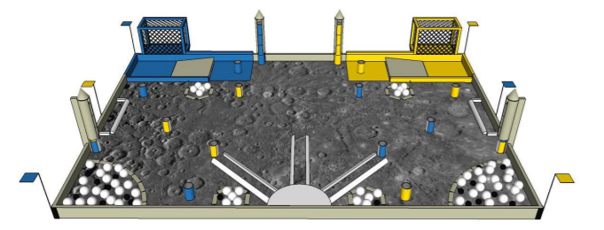

# Calcul de la position réelle du robot

Le calcul de la position réelle est à réaliser en même temps que celui de l'asservissement en vitesse.

## Données

Nous disposons des données suivantes :

- ticks des codeuses
- distance séparant les 2 codeuses: voie
- nombre de ticks par tour de roue
- périmètre d'une roue codeuse

A partir du nombre de ticks, on calcule la distance réelle parcourue par le robot.

On place l'origine de l'axe x,y en bas à gauche du plateau. On place le plateau comme dans l'image ci-après, avec la zone de départ bleue placée en haut à gauche. 
 
L'axe y est dirigé vers la zone de départ bleue. L'axe x est dirigé vers le coin cratère de minerai jaune.

## Equations

Donnée                           | Nom de la variable
-------------------------------- | ------------------
Angle effectué en radian         | a
Distance parcourue               | d
Distance parcourue selon l'axe x | x
Distance parcourue selon l'axe y | y

- d = (ticks/nombre_ticks_par_tour_de_roue)\*perimetre_roue_codeuse
- en cas de rotation, a = voie/d
- x = d*cos(a)
- y = d*sin(a)
